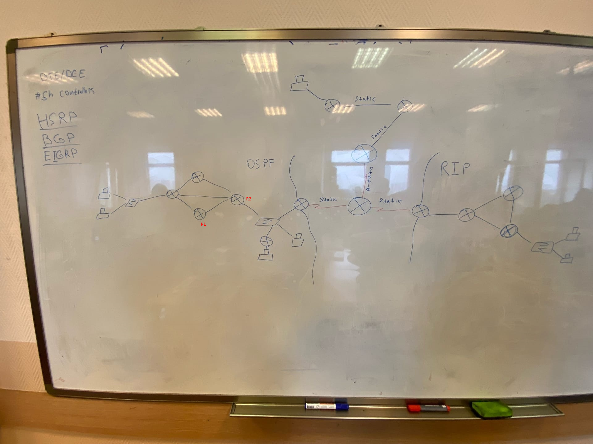

# Лабораторная работа 4. Routing

Топология: 

Задание: 

Построить приведенную топологию в Cisco Packet Tracer, настроить OSPF, RIP и Static для маршрутизации.

Доп задание:

Сделать балансировку между R1 и R2.
