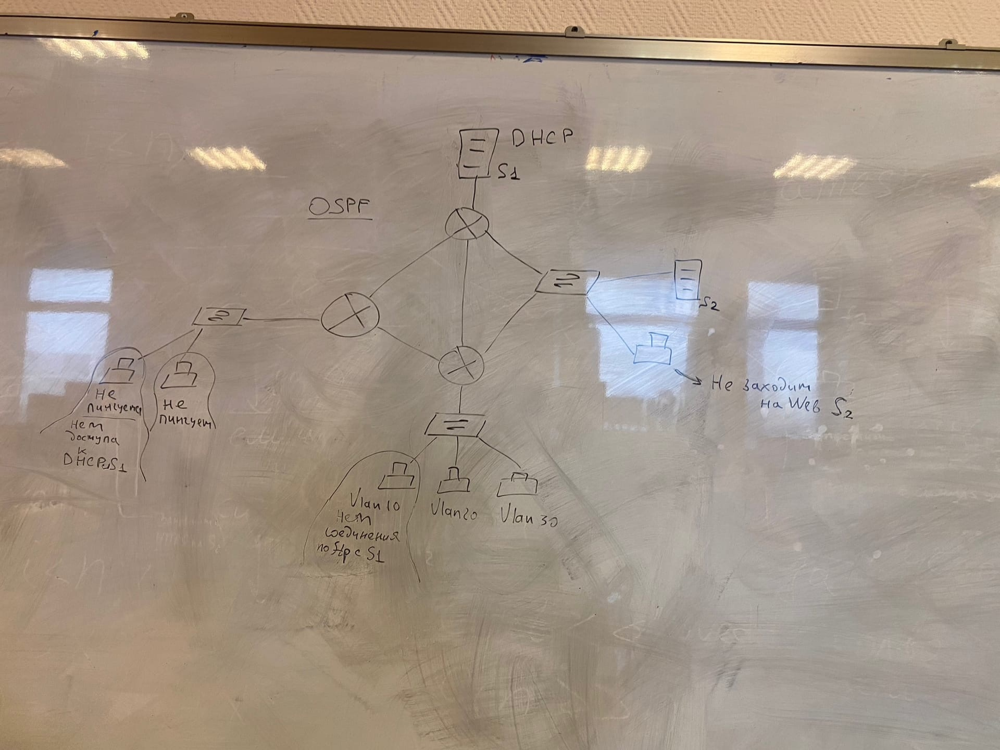

# Лабораторная работа 5. ACL

Топология: 

Задание: 

Построить приведенную топологию в Cisco Packet Tracer, настроить Access-lists.

Доп задание:

Для компьютера в VLAN10 запретить пассивный режим FTP. 
