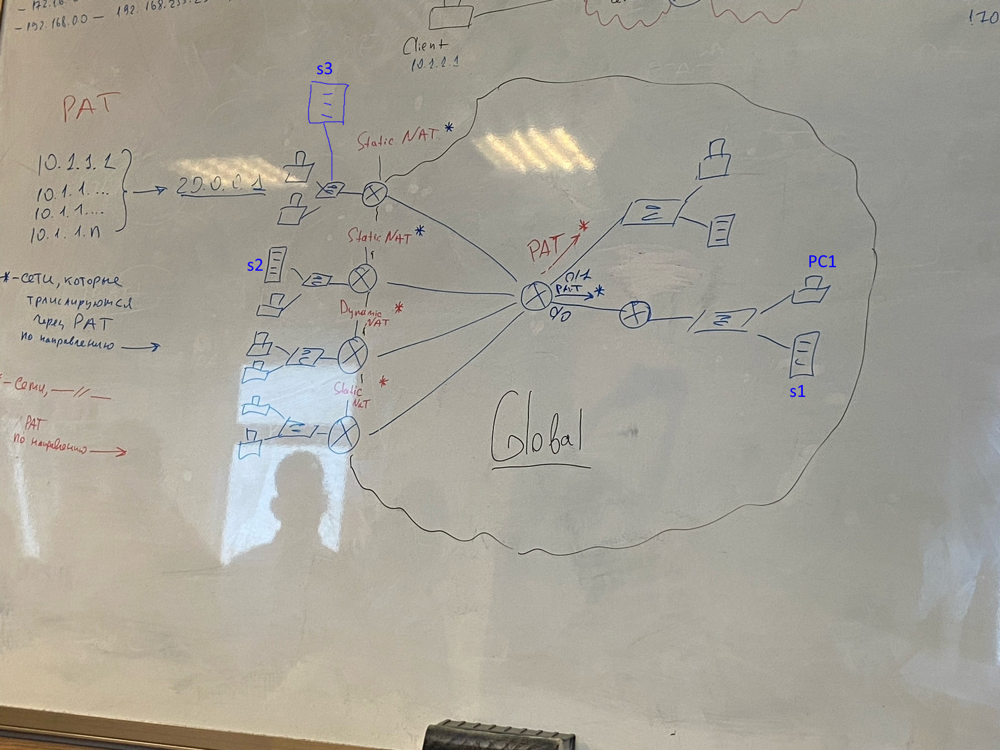

# Лабораторная работа 6. NAT

Топология: 

Задание: 

Построить приведенную топологию в Cisco Packet Tracer, настроить NAT и PAT.

Доп задание:

Добавить сервер S3. Настроить DNS на S1. Сделать так, чтобы http-запрос с PC1 
по какому-либо доменному имени шел на S2, а https-запрос по тому же домену шел на S3. 
